# Compte Rendu — Activité Pratique N°1
## Implémentation d'un Microservice Spring Boot : Gestion des Comptes Bancaires

**Filière :** BDCC II  
**Module :** Architecture des Systèmes Distribués (JEE & Middlewares)  
**Encadrant :** Pr. Mohamed YOUSSFI  
**Réalisé par :** Siham TAYEBI  
**Date :** Octobre 2026

---

## Table des matières

1. [Introduction](#1-introduction)
2. [Création du projet Spring Boot](#2-création-du-projet-spring-boot)
3. [Entité JPA BankAccount](#3-entité-jpa-bankaccount)
4. [Repository Spring Data](#4-repository-spring-data)
5. [Test de la couche DAO](#5-test-de-la-couche-dao)
6. [Web Service RESTful](#6-web-service-restful)
7. [Tests avec Postman](#7-tests-avec-postman)
8. [Documentation Swagger / OpenAPI](#8-documentation-swagger--openapi)
9. [Spring Data REST et Projections](#9-spring-data-rest-et-projections)
10. [DTOs et Mappers](#10-dtos-et-mappers)
11. [Couche Service (métier)](#11-couche-service-métier)
12. [Web Service GraphQL](#12-web-service-graphql)
13. [Entité Customer et relations](#13-entité-customer-et-relations)
14. [Comparaison des approches](#14-comparaison-des-approches)
15. [Conclusion](#15-conclusion)

---

## 1. Introduction

Ce travail pratique consiste à concevoir et développer un microservice Spring Boot permettant de gérer des comptes bancaires. L'objectif est de mettre en pratique une architecture en couches respectant les bonnes pratiques du développement JEE :

- **Couche DAO** : accès aux données avec Spring Data JPA et une base H2 en mémoire
- **Couche Service** : logique métier avec DTOs et Mappers
- **Couche Web** : exposition des données via des API REST
- **Spring Data REST** : exposition automatique du repository avec support des projections
- **GraphQL** : exposition d'une API flexible permettant au client de choisir les champs souhaités

### Architecture générale

```
┌──────────────────────────────────────────────────────────┐
│               Client (Postman / Browser / GraphiQL)      │
└────────────────────────┬─────────────────────────────────┘
                         │ HTTP/REST  ou  HTTP/GraphQL
                         ▼
┌──────────────────────────────────────────────────────────┐
│    Web Layer : AccountRestController  (/api)             │
│              + BankAccountGraphQLController (/graphql)   │
│              + Spring Data REST (/bankAccounts)          │
└────────────────────────┬─────────────────────────────────┘
                         │
                         ▼
┌──────────────────────────────────────────────────────────┐
│          Service Layer : AccountService                  │
│          + DTOs (Request / Response)                     │
│          + AccountMapper                                 │
└────────────────────────┬─────────────────────────────────┘
                         │
                         ▼
┌──────────────────────────────────────────────────────────┐
│   DAO Layer : BankAccountRepository + CustomerRepository │
│   Spring Data JPA + Hibernate                            │
└────────────────────────┬─────────────────────────────────┘
                         │
                         ▼
┌──────────────────────────────────────────────────────────┐
│              Base de données H2 (en mémoire)             │
└──────────────────────────────────────────────────────────┘
```

---

## 2. Création du projet Spring Boot

### 2.1 Initialisation via Spring Initializr

Le projet a été créé depuis [start.spring.io](https://start.spring.io) avec les dépendances suivantes :

| Dépendance | Rôle |
|---|---|
| **Spring Web** | Exposition des API REST |
| **Spring Data JPA** | Accès aux données avec Hibernate/JPA |
| **H2 Database** | Base de données en mémoire pour le développement |
| **Lombok** | Réduction du code répétitif (getters, setters, builders) |


### 2.2 Structure des packages

```
net.tayebi.tp1_ssd_e_back_service
├── entities/
│   ├── BankAccount.java
│   ├── AccountType.java               ← Enum
│   ├── Customer.java
│   └── BankAccountProjection.java     ← Projection Spring Data REST
├── repositories/
│   ├── BankAccountRepository.java
│   └── CustomerRepository.java
├── dtos/
│   ├── BankAccountRequestDTO.java
│   └── BankAccountDTOResponse.java
├── mappers/
│   └── AccountMapper.java
├── service/
│   ├── AccountService.java
│   └── AccountServiceImpl.java
├── web/
│   ├── AccountRestController.java
│   └── BankAccountGraphQLController.java
├── exceptions/
│   └── CustomDataFetcherExceptionResolver.java
└── Tp1SsdEBackServiceApplication.java
```

### 2.3 Configuration (application.properties)

```properties
spring.application.name=tp1_ssd_e_back_service

# Base de données H2 en mémoire
spring.datasource.url=jdbc:h2:mem:account-db
spring.h2.console.enabled=true

# Port du serveur
server.port=8080

# Activation de l'interface GraphiQL (interface web pour tester GraphQL)
spring.graphql.graphiql.enabled=true
```

> **Note :** La base H2 est en mode mémoire (`mem:`). Les données sont perdues à chaque redémarrage, ce qui est adapté au développement et aux tests.

> **GraalVM (note du cours) :** Une fois le JAR généré, il est possible de le compiler en exécutable natif avec GraalVM pour un démarrage quasi instantané. Cela sort du cadre de ce TP mais constitue une amélioration importante pour la production.

---

## 3. Entité JPA BankAccount

### 3.1 L'enum AccountType

```java
package net.tayebi.tp1_ssd_e_back_service.entities;

public enum AccountType {
    CURRENT_ACCOUNT,   // Compte courant
    SAVINGS_ACCOUNT    // Compte épargne
}
```

### 3.2 L'entité BankAccount — première version

```java
package net.tayebi.tp1_ssd_e_back_service.entities;

import jakarta.persistence.Entity;
import jakarta.persistence.Id;
import lombok.*;
import java.util.Date;

@Entity
@Data               // Génère getters, setters, toString, equals, hashCode
@AllArgsConstructor // Constructeur avec tous les champs
@NoArgsConstructor  // Constructeur vide (obligatoire pour JPA)
@Builder            // Pattern Builder : BankAccount.builder().id(...).build()
public class BankAccount {
    @Id
    private String id;
    private Date createdAt;
    private double balance;
    private String currency;
    private AccountType type;
}
```

**Explication des annotations :**

| Annotation | Rôle |
|---|---|
| `@Entity` | Déclare que cette classe est une table JPA |
| `@Id` | Désigne la clé primaire |
| `@Data` | Lombok : génère getters, setters, toString, equals, hashCode |
| `@Builder` | Lombok : permet la construction fluide d'objets |
| `@AllArgsConstructor` | Lombok : constructeur avec tous les champs |
| `@NoArgsConstructor` | Lombok : constructeur vide, requis par JPA |

### 3.3 Problème : l'enum stocké en entier

Lors du premier test, on constate que le champ `type` est stocké en base sous forme d'entier :

```
TYPE : 0  →  CURRENT_ACCOUNT
TYPE : 1  →  SAVINGS_ACCOUNT
```

Ce comportement par défaut de JPA est peu lisible et fragile : si l'ordre des valeurs de l'enum change, les données en base deviennent incohérentes.


### 3.4 Correction avec @Enumerated(EnumType.STRING)

On ajoute `@Enumerated(EnumType.STRING)` sur le champ `type` pour stocker le nom textuel de l'enum :

```java
import jakarta.persistence.EnumType;
import jakarta.persistence.Enumerated;

@Entity
@Data @AllArgsConstructor @NoArgsConstructor @Builder
public class BankAccount {
    @Id
    private String id;
    private Date createdAt;
    private double balance;
    private String currency;

    @Enumerated(EnumType.STRING)  // ← Stocke "CURRENT_ACCOUNT" au lieu de 0
    private AccountType type;
}
```

Après correction, la valeur est stockée en clair :

```
TYPE : CURRENT_ACCOUNT
TYPE : SAVINGS_ACCOUNT
```


---

## 4. Repository Spring Data

Spring Data JPA génère automatiquement toute l'implémentation CRUD. Il suffit de déclarer une interface :

```java
package net.tayebi.tp1_ssd_e_back_service.repositories;

import net.tayebi.tp1_ssd_e_back_service.entities.BankAccount;
import org.springframework.data.jpa.repository.JpaRepository;

public interface BankAccountRepository extends JpaRepository<BankAccount, String> {
    // Aucune implémentation nécessaire.
    // Spring génère automatiquement :
    // save(), findById(), findAll(), deleteById(), count(), existsById()...
}
```

`JpaRepository<BankAccount, String>` :
- `BankAccount` : type de l'entité gérée
- `String` : type de la clé primaire (`id` est un UUID de type `String`)

---

## 5. Test de la couche DAO

Pour valider la couche DAO, on utilise un `CommandLineRunner` dans la classe principale. Ce bean Spring s'exécute **automatiquement au démarrage** et insère 10 comptes de test en base.

```java
package net.tayebi.tp1_ssd_e_back_service;

import net.tayebi.tp1_ssd_e_back_service.enums.AccountType;
import net.tayebi.tp1_ssd_e_back_service.entities.BankAccount;
import net.tayebi.tp1_ssd_e_back_service.repositories.BankAccountRepository;
import org.springframework.boot.CommandLineRunner;
import org.springframework.boot.SpringApplication;
import org.springframework.boot.autoconfigure.SpringBootApplication;
import org.springframework.context.annotation.Bean;
import java.util.Date;
import java.util.UUID;

@SpringBootApplication
public class Tp1SsdEBackServiceApplication {

    public static void main(String[] args) {
        SpringApplication.run(Tp1SsdEBackServiceApplication.class, args);
    }

    @Bean
    CommandLineRunner start(BankAccountRepository bankAccountRepository) {
        return args -> {
            for (int i = 1; i <= 10; i++) {
                BankAccount bankAccount = BankAccount.builder()
                        .id(UUID.randomUUID().toString())                    // ID unique généré
                        .type(Math.random() > 0.5                           // Type aléatoire 50/50
                                ? AccountType.CURRENT_ACCOUNT
                                : AccountType.SAVINGS_ACCOUNT)
                        .balance(10000 + Math.random() * 90000)             // Solde entre 10k et 100k MAD
                        .createdAt(new Date())
                        .currency("MAD")
                        .build();
                bankAccountRepository.save(bankAccount);
            }
        };
    }
}
```

**Explication :**

| Instruction | Rôle |
|---|---|
| `@Bean CommandLineRunner` | Spring exécute cette méthode après le démarrage du contexte |
| `UUID.randomUUID().toString()` | Génère un identifiant universellement unique |
| `Math.random() > 0.5` | Répartition aléatoire 50/50 entre les deux types de comptes |
| `bankAccountRepository.save()` | Persiste l'objet en base via Spring Data JPA |

### Vérification dans la console H2

On accède à `http://localhost:8080/h2-console` avec les paramètres :
- **JDBC URL :** `jdbc:h2:mem:account-db`
- **Username :** `sa` / **Password :** *(vide)*


---

## 6. Web Service RESTful

### 6.1 Création du contrôleur REST

On crée le package `web` et la classe `AccountRestController` :

```java
package net.tayebi.tp1_ssd_e_back_service.web;

import lombok.AllArgsConstructor;
import net.tayebi.tp1_ssd_e_back_service.entities.BankAccount;
import net.tayebi.tp1_ssd_e_back_service.repositories.BankAccountRepository;
import org.springframework.web.bind.annotation.*;
import java.util.List;
import java.util.UUID;

@RestController       // Retourne du JSON automatiquement
@AllArgsConstructor   // Injection des dépendances par constructeur
@RequestMapping("/api") // Préfixe de toutes les routes
public class AccountRestController {

    private BankAccountRepository bankAccountRepository;

    // GET /api/bankAccounts → liste de tous les comptes
    @GetMapping("/bankAccounts")
    public List<BankAccount> bankAccounts() {
        return bankAccountRepository.findAll();
    }

    // GET /api/bankAccounts/{id} → détail d'un compte par ID
    @GetMapping("/bankAccounts/{id}")
    public BankAccount bankAccount(@PathVariable String id) {
        return bankAccountRepository.findById(id)
                .orElseThrow(() -> new RuntimeException(
                        String.format("Bank account with id %s not found", id)
                ));
    }

    // DELETE /api/bankAccounts/{id} → suppression d'un compte
    @DeleteMapping("/bankAccounts/{id}")
    public void deleteAccount(@PathVariable String id) {
        bankAccountRepository.deleteById(id);
    }

    // POST /api/bankAccounts → création d'un compte
    // @RequestBody : Spring désérialise automatiquement le JSON reçu en objet Java
    @PostMapping("/bankAccounts")
    public BankAccount save(@RequestBody BankAccount bankAccount) {
        // Génération de l'ID si le client n'en a pas fourni
        if (bankAccount.getId() == null) {
            bankAccount.setId(UUID.randomUUID().toString());
        }
        return bankAccountRepository.save(bankAccount);
    }

    // PUT /api/bankAccounts/{id} → mise à jour d'un compte (champs fournis seulement)
    @PutMapping("/bankAccounts/{id}")
    public BankAccount update(@PathVariable String id, @RequestBody BankAccount bankAccount) {
        // 1. Charger le compte existant en base (état 'Managed' par JPA)
        BankAccount account = bankAccountRepository.findById(id)
                .orElseThrow(() -> new RuntimeException(
                        String.format("Account %s not found", id)
                ));
        // 2. Mettre à jour uniquement les champs non null envoyés par le client
        if (bankAccount.getBalance() != 0)     account.setBalance(bankAccount.getBalance());
        if (bankAccount.getCurrency() != null) account.setCurrency(bankAccount.getCurrency());
        if (bankAccount.getType() != null)     account.setType(bankAccount.getType());

        // 3. Sauvegarder et retourner
        return bankAccountRepository.save(account);
    }
}
```

> **Différence PUT vs PATCH :**
> - `PUT` : envoie l'objet complet, remplace toutes les valeurs
> - `PATCH` : envoie uniquement les champs à modifier

### 6.2 Tableau des endpoints REST

| Méthode | URL | Corps | Description |
|---|---|---|---|
| `GET` | `/api/bankAccounts` | — | Liste tous les comptes |
| `GET` | `/api/bankAccounts/{id}` | — | Détail d'un compte |
| `POST` | `/api/bankAccounts` | JSON | Crée un compte |
| `PUT` | `/api/bankAccounts/{id}` | JSON partiel | Met à jour un compte |
| `DELETE` | `/api/bankAccounts/{id}` | — | Supprime un compte |

### 6.3 Tests depuis le navigateur

**GET /api/bankAccounts :**


**GET /api/bankAccounts/{id} :**


---

## 7. Tests avec Postman

### 7.1 Test POST — Créer un compte

- **Méthode :** `POST`
- **URL :** `http://localhost:8080/api/bankAccounts`
- **Header :** `Content-Type: application/json`
- **Body :**

```json
{
    "balance": 75000.0,
    "currency": "MAD",
    "type": "CURRENT_ACCOUNT"
}
```

> **Remarque :** On ne fournit pas l'`id` ni `createdAt` : ils sont générés automatiquement côté serveur.


### 7.2 Test PATCH — Mise à jour partielle

Le PATCH permet de ne modifier qu'un ou plusieurs attributs :


### 7.3 Test PUT — Mise à jour complète


---

## 8. Documentation Swagger / OpenAPI

### 8.1 Ajout de la dépendance SpringDoc

```xml
<dependency>
    <groupId>org.springdoc</groupId>
    <artifactId>springdoc-openapi-starter-webmvc-ui</artifactId>
    <version>2.6.0</version>
</dependency>
```

Après redémarrage, la documentation est automatiquement disponible :

| Interface | URL |
|---|---|
| **Swagger UI** (interface graphique) | `http://localhost:8080/swagger-ui.html` |
| **Spécification JSON OpenAPI** | `http://localhost:8080/v3/api-docs` |

### 8.2 Interface Swagger UI

SpringDoc génère une interface graphique interactive sans aucune configuration supplémentaire :

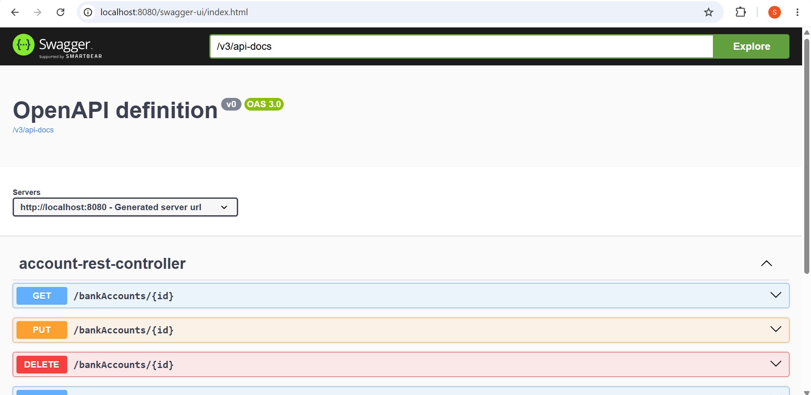

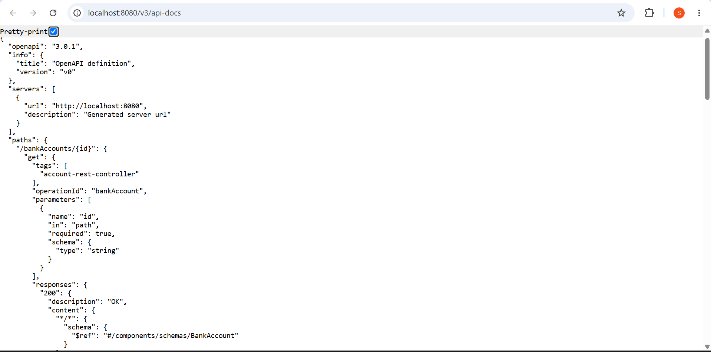

### 8.3 Tests des routes dans Swagger

**GET /bankAccounts/{id} :**

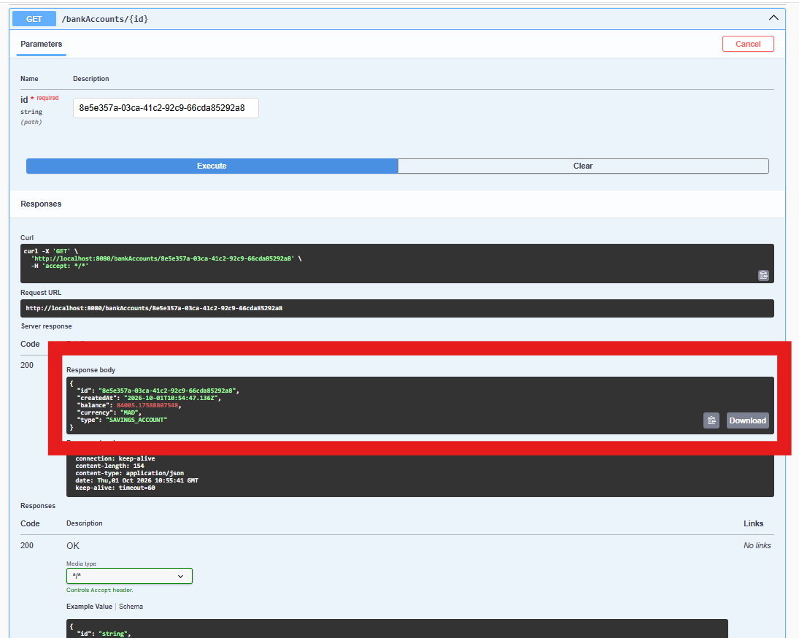

**PUT /bankAccounts/{id} :**

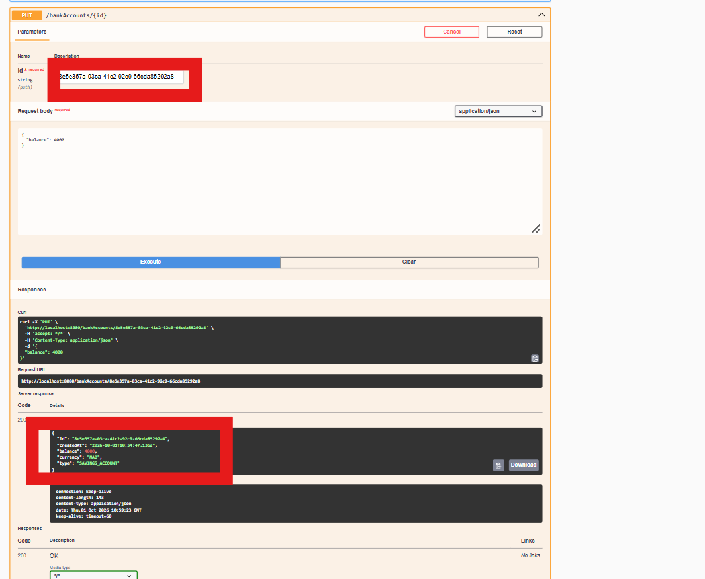

**DELETE /bankAccounts/{id} :**

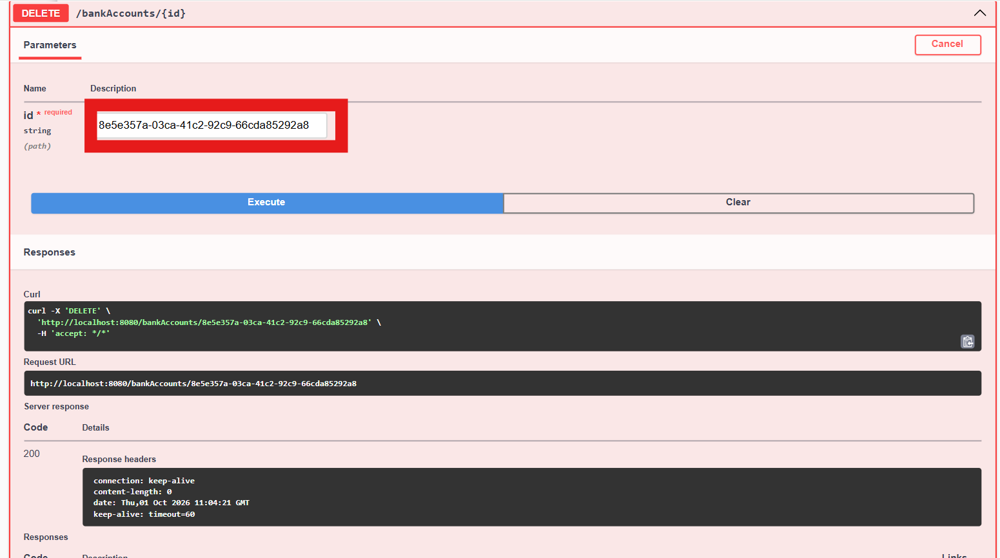

**GET /bankAccounts :**

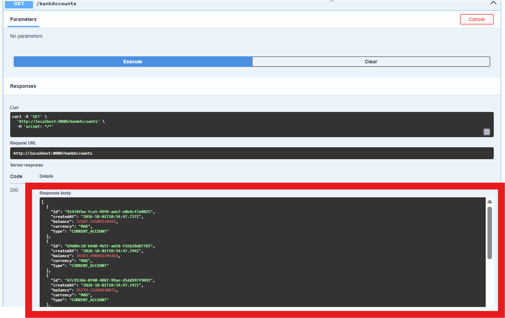

**POST /bankAccounts :**

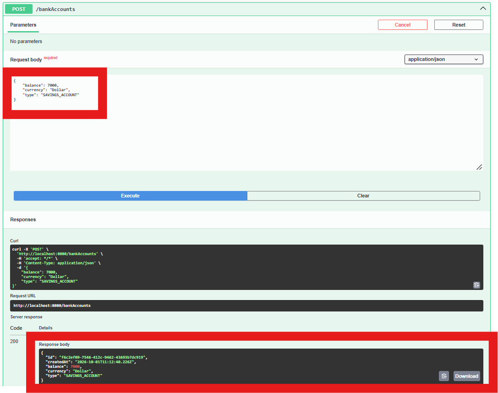

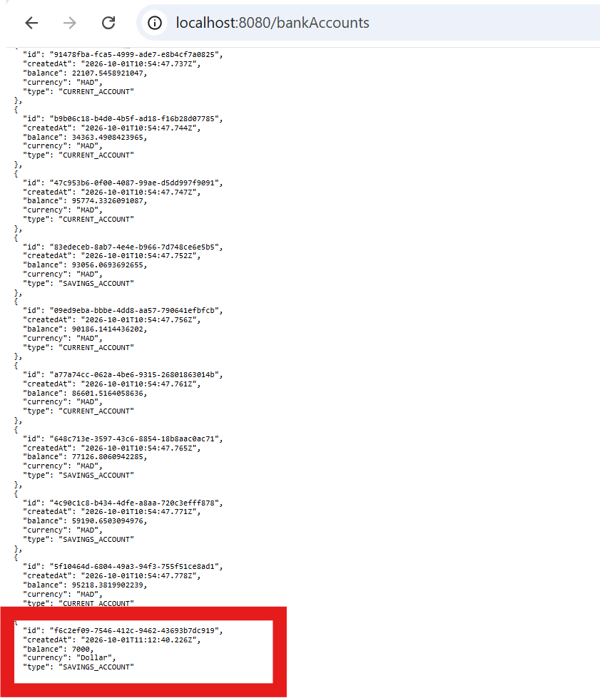

### 8.4 Import dans Postman via l'URL OpenAPI

```
http://localhost:8080/v3/api-docs
```

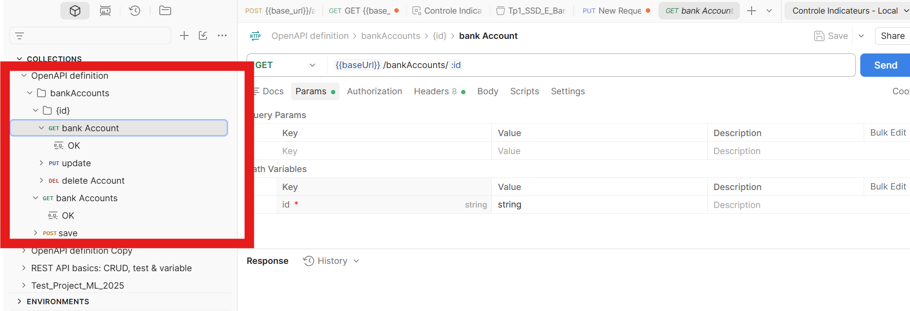

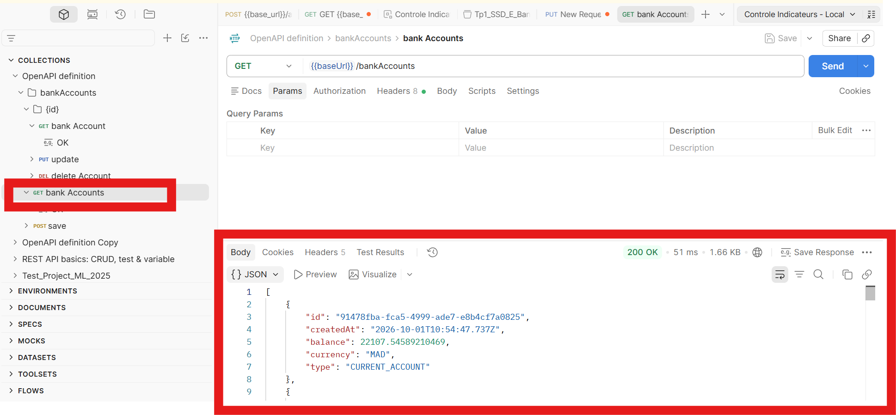

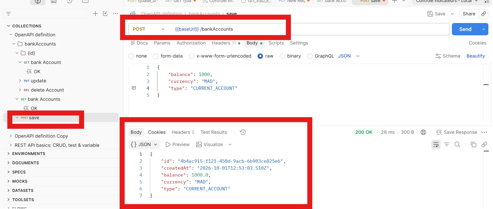

---

## 9. Spring Data REST et Projections

### 9.1 Ajout de la dépendance

Spring Data REST génère automatiquement un web service REST complet pour toute entité JPA, sans écrire de contrôleur, en ajoutant le format **HATEOAS** (liens hypermédias) aux réponses.

```xml
<dependency>
    <groupId>org.springframework.boot</groupId>
    <artifactId>spring-boot-starter-data-rest</artifactId>
</dependency>
```

### 9.2 Annotation du Repository

```java
package net.tayebi.tp1_ssd_e_back_service.repositories;

import net.tayebi.tp1_ssd_e_back_service.entities.BankAccount;
import net.tayebi.tp1_ssd_e_back_service.enums.AccountType;
import org.springframework.data.jpa.repository.JpaRepository;
import org.springframework.data.repository.query.Param;
import org.springframework.data.rest.core.annotation.RepositoryRestResource;
import org.springframework.data.rest.core.annotation.RestResource;
import java.util.List;

@RepositoryRestResource  // Spring Data REST crée tout le CRUD automatiquement
public interface BankAccountRepository extends JpaRepository<BankAccount, String> {

    // Recherche par type avec alias d'URL et de paramètre
    @RestResource(path = "/byType")              // URL : /bankAccounts/search/byType
    List<BankAccount> findByType(@Param("t") AccountType type); // Paramètre : ?t=...
}
```

> **Note :** Comme notre contrôleur manuel `AccountRestController` utilise déjà `/api/bankAccounts`, Spring Data REST répond sur `/bankAccounts` (sans préfixe `/api`). Cela permet d'avoir les deux en parallèle.

### 9.3 Comparaison REST Controller vs Spring Data REST

| Critère | `AccountRestController` (`/api`) | Spring Data REST (`/bankAccounts`) |
|---|---|---|
| Code à écrire | Contrôleur complet | Juste `@RepositoryRestResource` |
| Format de réponse | JSON simple | JSON + liens HATEOAS (`_links`) |
| Pagination | Non (par défaut) | Oui, automatique |
| Recherches personnalisées | Méthodes manuelles | Depuis le repository |
| Flexibilité | Totale | Limitée aux conventions |

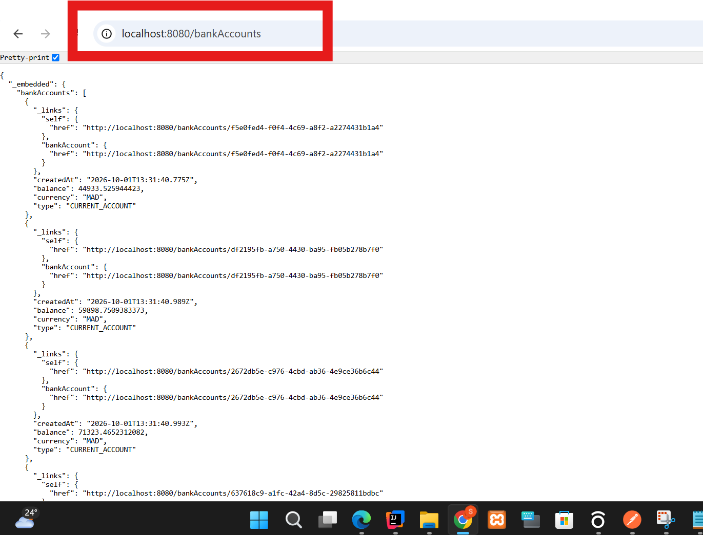

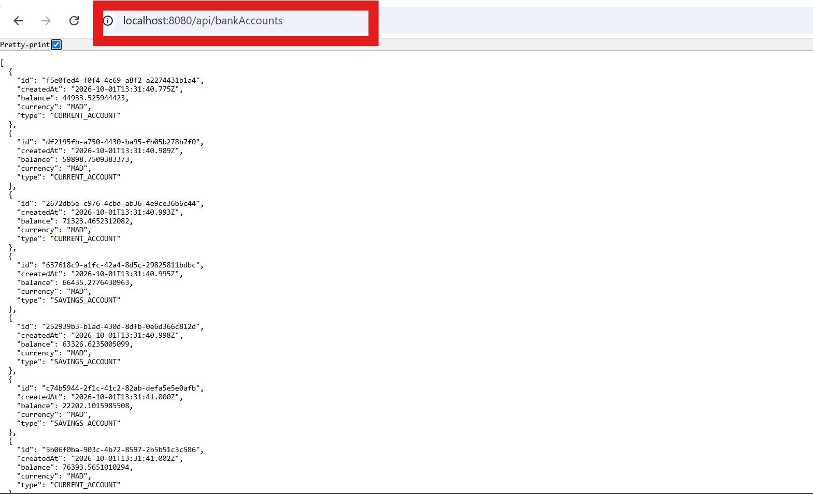

### 9.4 Accès au détail d'un compte

```
GET http://localhost:8080/bankAccounts/{id}
```

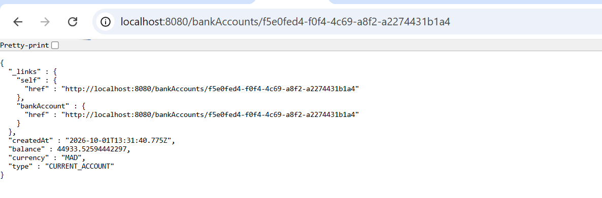

### 9.5 Pagination automatique

```
GET http://localhost:8080/bankAccounts?page=0&size=2
```

```json
{
  "_embedded": {
    "bankAccounts": [
      {
        "createdAt": "2026-10-01T13:31:40.775Z",
        "balance": 44933.52,
        "currency": "MAD",
        "type": "CURRENT_ACCOUNT",
        "_links": {
          "self": { "href": "http://localhost:8080/bankAccounts/f5e0fed4-..." },
          "bankAccount": { "href": "http://localhost:8080/bankAccounts/f5e0fed4-..." }
        }
      }
    ]
  },
  "_links": {
    "first": { "href": "http://localhost:8080/bankAccounts?page=0&size=2" },
    "next":  { "href": "http://localhost:8080/bankAccounts?page=1&size=2" },
    "last":  { "href": "http://localhost:8080/bankAccounts?page=4&size=2" }
  },
  "page": { "number": 0, "size": 2, "totalElements": 10, "totalPages": 5 }
}
```

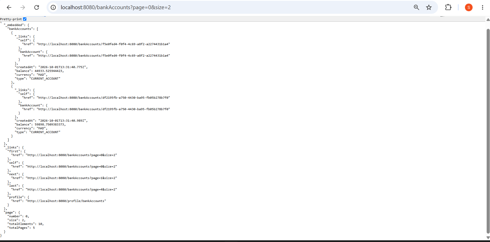

### 9.6 Recherche par type de compte

```
GET http://localhost:8080/bankAccounts/search/byType?t=CURRENT_ACCOUNT
GET http://localhost:8080/bankAccounts/search/byType?t=SAVINGS_ACCOUNT
```

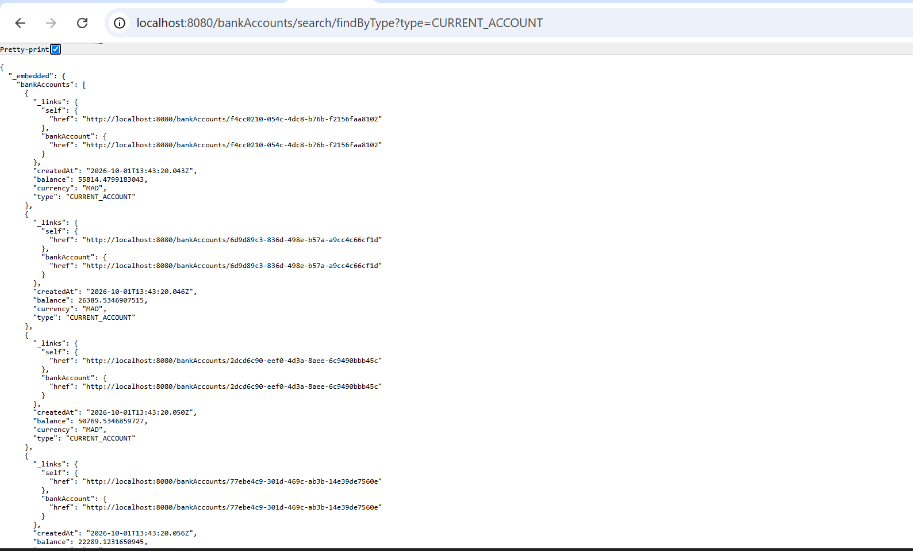

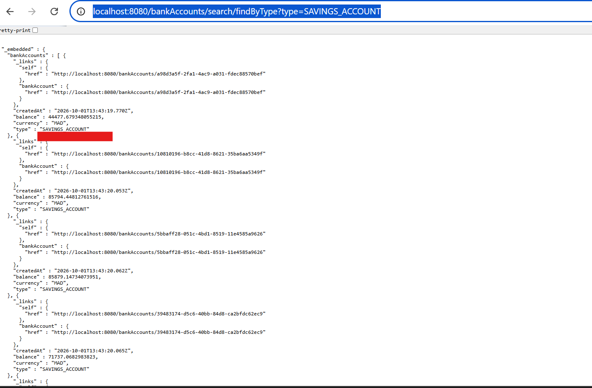

### 9.7 Projection — Contrôle des champs retournés

Par défaut, Spring Data REST ne retourne pas l'`id` dans le JSON (il est dans `_links`). Pour choisir précisément les champs exposés, on crée une **Projection** :

```java
package net.tayebi.tp1_ssd_e_back_service.entities;

import net.tayebi.tp1_ssd_e_back_service.enums.AccountType;
import org.springframework.data.rest.core.config.Projection;

@Projection(
    types = BankAccount.class,  // Entité cible
    name = "p1"                  // Nom utilisé dans l'URL
)
public interface BankAccountProjection {
    String getId();
    AccountType getType();
    // Ajouter ici tous les getters des champs à exposer
}
```

**Utilisation :**
```
GET http://localhost:8080/bankAccounts?projection=p1
```

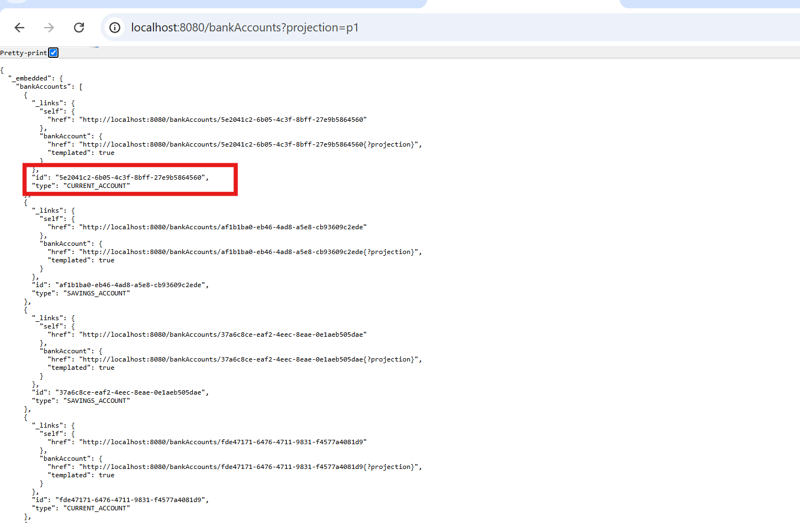

> **Projection vs GraphQL :**
> Avec Spring Data REST, les champs exposés sont définis **côté serveur** dans l'interface de projection.
> Avec **GraphQL**, c'est le **client** qui spécifie dynamiquement les champs souhaités dans chaque requête — approche bien plus flexible.

### 9.8 Alias pour URLs et paramètres

```java
// AVANT (URL par défaut) :
// GET /bankAccounts/search/findByType?type=SAVINGS_ACCOUNT

// APRÈS (avec alias) :
@RestResource(path = "/byType")
List<BankAccount> findByType(@Param("t") AccountType type);
// GET /bankAccounts/search/byType?t=SAVINGS_ACCOUNT
```

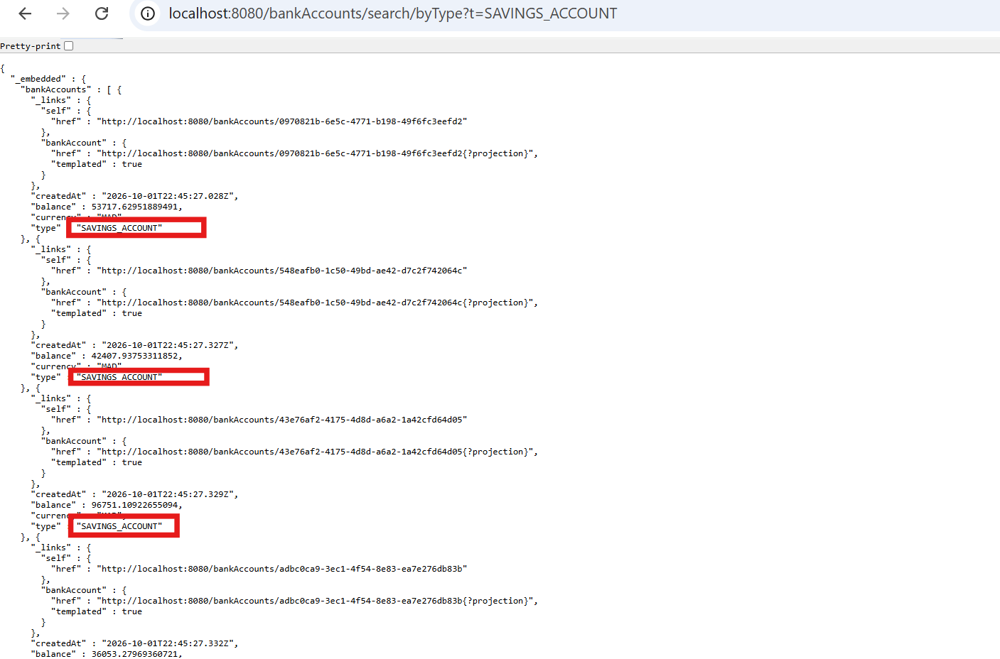

---

## 10. DTOs et Mappers

### 10.1 Pourquoi les DTOs ?

Exposer directement les entités JPA dans l'API pose des problèmes :
- On expose tous les champs, y compris les données sensibles
- Le client peut envoyer des champs qu'il ne devrait pas contrôler (ex : `id`, `createdAt`)
- Couplage fort entre la couche persistance et la couche présentation

On utilise donc des **DTOs (Data Transfer Objects)** :

| DTO | Sens | Champs |
|---|---|---|
| `BankAccountRequestDTO` | Client → Serveur | `balance`, `currency`, `type` |
| `BankAccountDTOResponse` | Serveur → Client | `id`, `createdAt`, `balance`, `currency`, `type` |

### 10.2 BankAccountRequestDTO

```java
package net.tayebi.tp1_ssd_e_back_service.dtos;

import lombok.*;
import net.tayebi.tp1_ssd_e_back_service.enums.AccountType;

@Data @AllArgsConstructor @NoArgsConstructor @Builder
public class BankAccountRequestDTO {
    private Double balance;
    private String currency;
    private AccountType type;
    // id et createdAt sont générés côté serveur → non inclus
}
```

### 10.3 BankAccountDTOResponse

```java
package net.tayebi.tp1_ssd_e_back_service.dtos;

import lombok.*;
import net.tayebi.tp1_ssd_e_back_service.enums.AccountType;
import java.util.Date;

@Data @AllArgsConstructor @NoArgsConstructor @Builder
public class BankAccountDTOResponse {
    private String id;
    private Date createdAt;
    private Double balance;
    private String currency;
    private AccountType type;
}
```

### 10.4 AccountMapper

```java
package net.tayebi.tp1_ssd_e_back_service.mappers;

import net.tayebi.tp1_ssd_e_back_service.dtos.BankAccountDTOResponse;
import net.tayebi.tp1_ssd_e_back_service.entities.BankAccount;
import org.springframework.beans.BeanUtils;
import org.springframework.stereotype.Component;

@Component
public class AccountMapper {

    /**
     * Convertit une entité BankAccount en DTO de réponse.
     * BeanUtils.copyProperties copie automatiquement les champs
     * dont le nom correspond dans les deux objets.
     */
    public BankAccountDTOResponse fromBankAccount(BankAccount bankAccount) {
        BankAccountDTOResponse dto = new BankAccountDTOResponse();
        BeanUtils.copyProperties(bankAccount, dto);
        return dto;
    }
}
```

> **Note :** `BeanUtils.copyProperties()` copie les propriétés ayant le **même nom** dans les deux classes. Pour des mappings plus complexes, on peut utiliser **MapStruct**.

---

## 11. Couche Service (métier)

### 11.1 Interface AccountService

```java
package net.tayebi.tp1_ssd_e_back_service.service;

import net.tayebi.tp1_ssd_e_back_service.dtos.BankAccountDTOResponse;
import net.tayebi.tp1_ssd_e_back_service.dtos.BankAccountRequestDTO;

public interface AccountService {
    BankAccountDTOResponse addAccount(BankAccountRequestDTO bankAccountDTO);
    BankAccountDTOResponse updateAccount(String id, BankAccountRequestDTO bankAccountDTO);
}
```

### 11.2 AccountServiceImpl

```java
package net.tayebi.tp1_ssd_e_back_service.service;

import lombok.AllArgsConstructor;
import net.tayebi.tp1_ssd_e_back_service.dtos.BankAccountDTOResponse;
import net.tayebi.tp1_ssd_e_back_service.dtos.BankAccountRequestDTO;
import net.tayebi.tp1_ssd_e_back_service.entities.BankAccount;
import net.tayebi.tp1_ssd_e_back_service.mappers.AccountMapper;
import net.tayebi.tp1_ssd_e_back_service.repositories.BankAccountRepository;
import org.springframework.stereotype.Service;
import org.springframework.transaction.annotation.Transactional;
import java.util.Date;
import java.util.UUID;

@Service          // Composant de la couche métier Spring
@Transactional    // Chaque méthode est transactionnelle (cohérence des données garantie)
@AllArgsConstructor
public class AccountServiceImpl implements AccountService {

    private BankAccountRepository bankAccountRepository;
    private AccountMapper accountMapper;

    @Override
    public BankAccountDTOResponse addAccount(BankAccountRequestDTO bankAccountDTO) {
        // 1. Construire l'entité à partir du DTO
        BankAccount bankAccount = BankAccount.builder()
                .id(UUID.randomUUID().toString()) // ID généré côté serveur
                .createdAt(new Date())             // Date générée côté serveur
                .balance(bankAccountDTO.getBalance())
                .type(bankAccountDTO.getType())
                .currency(bankAccountDTO.getCurrency())
                .build();

        // 2. Persister en base
        BankAccount savedBankAccount = bankAccountRepository.save(bankAccount);

        // 3. Convertir et retourner le DTO de réponse
        return accountMapper.fromBankAccount(savedBankAccount);
    }

    @Override
    public BankAccountDTOResponse updateAccount(String id, BankAccountRequestDTO bankAccountDTO) {
        // Reconstruction de l'entité avec l'ID fourni
        BankAccount bankAccount = BankAccount.builder()
                .id(id)
                .createdAt(new Date())
                .balance(bankAccountDTO.getBalance())
                .type(bankAccountDTO.getType())
                .currency(bankAccountDTO.getCurrency())
                .build();

        BankAccount savedBankAccount = bankAccountRepository.save(bankAccount);
        return accountMapper.fromBankAccount(savedBankAccount);
    }
}
```

### 11.3 Contrôleur REST final avec la couche Service

```java
package net.tayebi.tp1_ssd_e_back_service.web;

import lombok.AllArgsConstructor;
import net.tayebi.tp1_ssd_e_back_service.dtos.BankAccountDTOResponse;
import net.tayebi.tp1_ssd_e_back_service.dtos.BankAccountRequestDTO;
import net.tayebi.tp1_ssd_e_back_service.entities.BankAccount;
import net.tayebi.tp1_ssd_e_back_service.mappers.AccountMapper;
import net.tayebi.tp1_ssd_e_back_service.repositories.BankAccountRepository;
import net.tayebi.tp1_ssd_e_back_service.service.AccountService;
import org.springframework.web.bind.annotation.*;
import java.util.List;

@RestController
@AllArgsConstructor
@RequestMapping("/api")
public class AccountRestController {

    private BankAccountRepository bankAccountRepository;
    private AccountService accountService;
    private AccountMapper accountMapper;

    @GetMapping("/bankAccounts")
    public List<BankAccount> bankAccounts() {
        return bankAccountRepository.findAll();
    }

    @GetMapping("/bankAccounts/{id}")
    public BankAccount bankAccount(@PathVariable String id) {
        return bankAccountRepository.findById(id)
                .orElseThrow(() -> new RuntimeException(
                        String.format("Bank account with id %s not found", id)));
    }

    @DeleteMapping("/bankAccounts/{id}")
    public void deleteAccount(@PathVariable String id) {
        bankAccountRepository.deleteById(id);
    }

    // Utilise maintenant le service et les DTOs
    @PostMapping("/bankAccounts")
    public BankAccountDTOResponse save(@RequestBody BankAccountRequestDTO bankAccountDTO) {
        return accountService.addAccount(bankAccountDTO);
    }

    @PutMapping("/bankAccounts/{id}")
    public BankAccount update(@PathVariable String id, @RequestBody BankAccount bankAccount) {
        BankAccount account = bankAccountRepository.findById(id)
                .orElseThrow(() -> new RuntimeException(
                        String.format("Account %s not found", id)));
        if (bankAccount.getBalance() != 0)     account.setBalance(bankAccount.getBalance());
        if (bankAccount.getCurrency() != null) account.setCurrency(bankAccount.getCurrency());
        if (bankAccount.getType() != null)     account.setType(bankAccount.getType());
        return bankAccountRepository.save(account);
    }
}
```

---

## 12. Web Service GraphQL

### 12.1 Comparaison des technologies de Web Services

Avant d'implémenter GraphQL, voici un rappel des différentes approches abordées en cours :

| Technologie | Usage typique | Format |
|---|---|---|
| **REST** | API Web universelle | JSON/HTTP |
| **GraphQL** | UI flexible (le client choisit les champs) | JSON/HTTP POST |
| **SOAP** | Clients précis, systèmes anciens | XML |
| **gRPC** | Communication backend-backend rapide | Protobuf binaire |
| **RMI** | Java pur, interfaces Java partagées | Java sérialisé |

> **Choix de la technologie :** REST pour les API publiques, GraphQL pour les interfaces (UI), SOAP pour les clients legacy, gRPC pour la communication inter-services backend. Cela dépend du projet.

### 12.2 Activation de GraphQL

On ajoute la dépendance Spring GraphQL dans `pom.xml` :

```xml
<dependency>
    <groupId>org.springframework.boot</groupId>
    <artifactId>spring-boot-starter-graphql</artifactId>
</dependency>
```

Et on active l'interface GraphiQL (équivalent de Swagger pour GraphQL) dans `application.properties` :

```properties
spring.graphql.graphiql.enabled=true
```

### 12.3 Le schéma GraphQL

> **Analogie :** En REST, la documentation de l'API est décrite dans l'**OpenAPI/Swagger** (ou `v3/api-docs`). En SOAP, c'est le **WSDL**. En gRPC, c'est le **proto**. En GraphQL, c'est le **schéma `.graphqls`**.

On crée le fichier `src/main/resources/graphql/schema.graphqls` :

```graphql
# Requêtes de lecture (équivalent GET en REST)
type Query {
    accountsList: [BankAccount]
    accountById(id: String): BankAccount
    customers: [Customer]
}

# Mutations = opérations d'écriture (équivalent POST/PUT/DELETE en REST)
type Mutation {
    addAccount(bankAccount: BankAccountDTO): BankAccount
    updateAccount(id: String, bankAccount: BankAccountDTO): BankAccount
    deleteAccount(id: String): Boolean
}

# Type représentant un compte bancaire en sortie
type BankAccount {
    id: String
    createdAt: Float
    balance: Float
    currency: String
    type: String
    customer: Customer
}

# Type représentant un client en sortie
type Customer {
    id: ID
    name: String
    bankAccounts: [BankAccount]
}

# Type d'entrée pour la création / mise à jour (input = DTO en GraphQL)
input BankAccountDTO {
    balance: Float
    currency: String
    type: String
}
```

**Points importants du schéma :**
- `type Query` : requêtes de lecture (analogues aux `@GetMapping`)
- `type Mutation` : opérations d'écriture (analogues aux `@PostMapping`, `@PutMapping`, `@DeleteMapping`)
- `input` : type d'entrée (équivalent du `BankAccountRequestDTO` en REST) — on n'expose que les champs nécessaires
- `createdAt` est de type `Float` car GraphQL ne supporte pas nativement `Date` Java ; on peut utiliser `Long` pour un timestamp

> **Remarque sur `createdAt` :** Le champ `createdAt` de type `Date` en Java n'est pas directement sérialisable en GraphQL. Il est mappé en `Float` (timestamp Unix) pour l'instant. Pour une meilleure solution, on pourrait utiliser un `Long` (timestamp en millisecondes) ou une librairie de scalar GraphQL pour les dates.

### 12.4 BankAccountGraphQLController

```java
package net.tayebi.tp1_ssd_e_back_service.web;

import lombok.AllArgsConstructor;
import net.tayebi.tp1_ssd_e_back_service.dtos.BankAccountDTOResponse;
import net.tayebi.tp1_ssd_e_back_service.dtos.BankAccountRequestDTO;
import net.tayebi.tp1_ssd_e_back_service.entities.BankAccount;
import net.tayebi.tp1_ssd_e_back_service.entities.Customer;
import net.tayebi.tp1_ssd_e_back_service.repositories.BankAccountRepository;
import net.tayebi.tp1_ssd_e_back_service.repositories.CustomerRepository;
import net.tayebi.tp1_ssd_e_back_service.service.AccountService;
import org.springframework.graphql.data.method.annotation.*;
import org.springframework.stereotype.Controller;
import java.util.List;

@Controller       // Pas @RestController ! Spring GraphQL utilise @Controller
@AllArgsConstructor
public class BankAccountGraphQLController {

    private BankAccountRepository bankAccountRepository;
    private CustomerRepository customerRepository;
    private AccountService accountService;

    // ─── QUERIES (lecture) ────────────────────────────────────────────────────

    // Correspond à accountsList dans le schéma
    @QueryMapping
    public List<BankAccount> accountsList() {
        return bankAccountRepository.findAll();
    }

    // Correspond à accountById(id: String) dans le schéma
    // @Argument : lie le paramètre GraphQL "id" à l'argument Java "id"
    @QueryMapping
    public BankAccount accountById(@Argument String id) {
        return bankAccountRepository.findById(id)
                .orElseThrow(() -> new RuntimeException(
                        String.format("Bank Account %s not found", id)
                ));
    }

    // Correspond à customers dans le schéma
    @QueryMapping
    public List<Customer> customers() {
        return customerRepository.findAll();
    }

    // ─── MUTATIONS (écriture) ─────────────────────────────────────────────────

    // Correspond à addAccount(bankAccount: BankAccountDTO) dans le schéma
    @MutationMapping
    public BankAccountDTOResponse addAccount(@Argument BankAccountRequestDTO bankAccount) {
        return accountService.addAccount(bankAccount);
    }

    // Correspond à updateAccount(id: String, bankAccount: BankAccountDTO)
    @MutationMapping
    public BankAccountDTOResponse updateAccount(
            @Argument String id,
            @Argument BankAccountRequestDTO bankAccount) {
        return accountService.updateAccount(id, bankAccount);
    }

    // Correspond à deleteAccount(id: String) : Boolean
    @MutationMapping
    public Boolean deleteAccount(@Argument String id) {
        bankAccountRepository.deleteById(id);
        return true; // On retourne true pour indiquer le succès de la suppression
    }
}
```

**Différences REST vs GraphQL côté contrôleur :**

| REST | GraphQL |
|---|---|
| `@RestController` | `@Controller` |
| `@GetMapping` | `@QueryMapping` |
| `@PostMapping` | `@MutationMapping` |
| `@RequestBody` | `@Argument` |
| `@PathVariable` | `@Argument` |

### 12.5 Accès à l'interface GraphiQL

On accède à l'interface GraphiQL via :
```
http://localhost:8080/graphiql
```

Toutes les requêtes GraphQL sont des `POST` envoyées à `/graphql`. GraphiQL est l'interface web qui nous permet de les écrire et les tester.

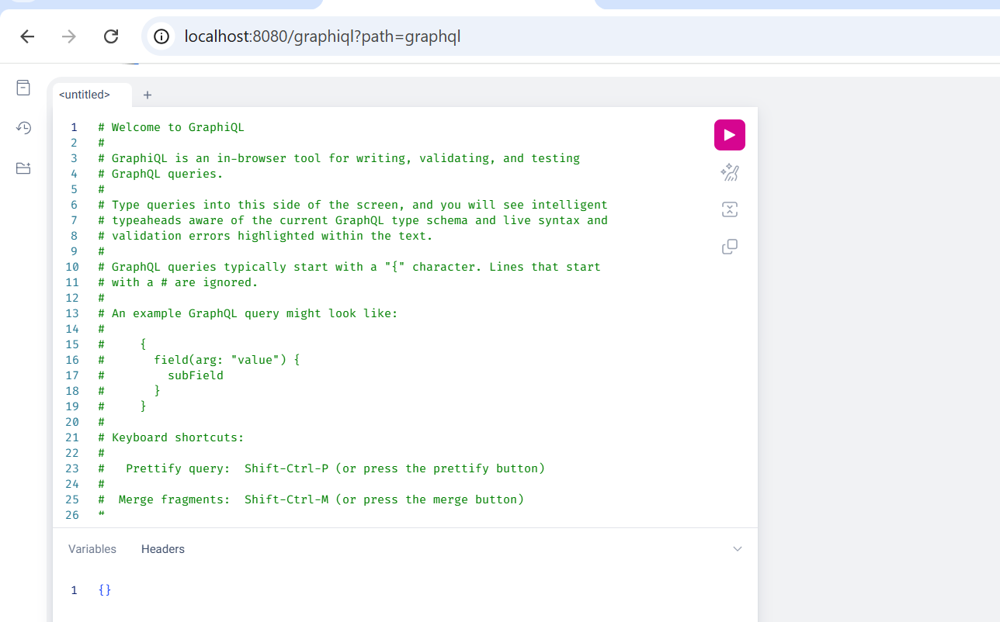

### 12.6 Requêtes GraphQL — Exemples

#### Récupérer uniquement les IDs

```graphql
query {
    accountsList {
        id
    }
}
```

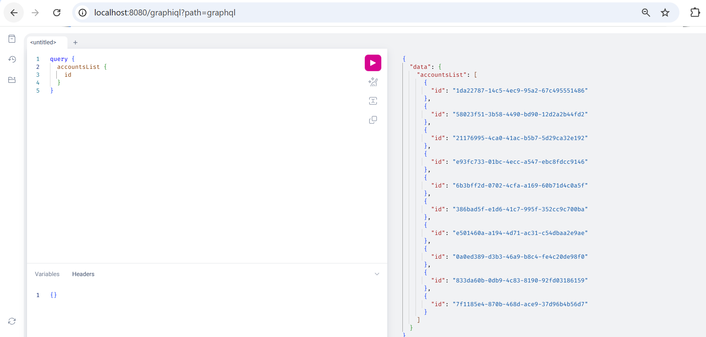

#### Récupérer ID et balance

```graphql
query {
    accountsList {
        id
        balance
    }
}
```

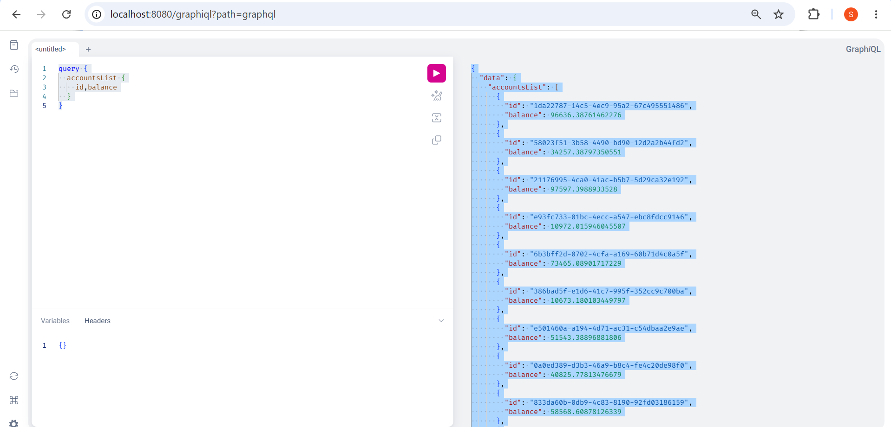

> **C'est la force de GraphQL :** le client décide exactement quels champs il veut. Le serveur ne retourne que les champs demandés. C'est de la **projection côté client**, contrairement à REST où le serveur retourne tout, et aux projections Spring Data REST définies côté serveur.

#### Récupérer createdAt, balance, id, currency

```graphql
query {
    accountsList {
        id
        balance
        currency
        createdAt
    }
}
```

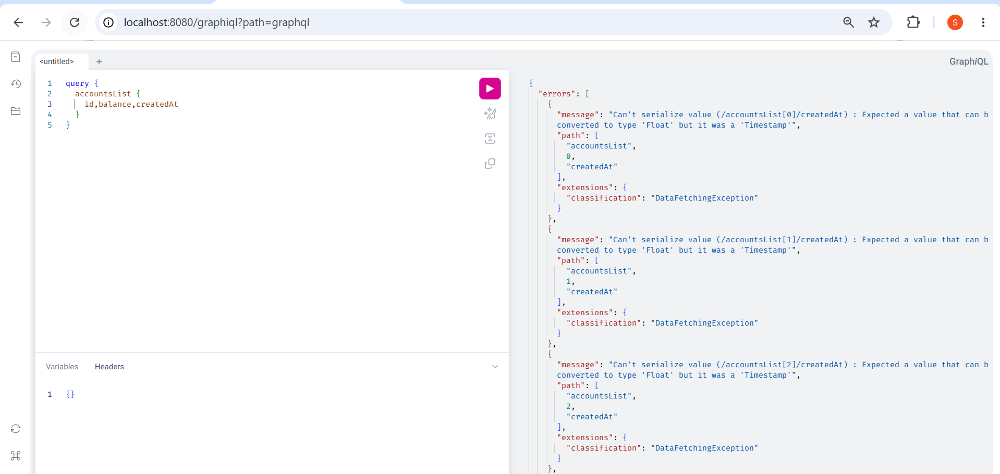

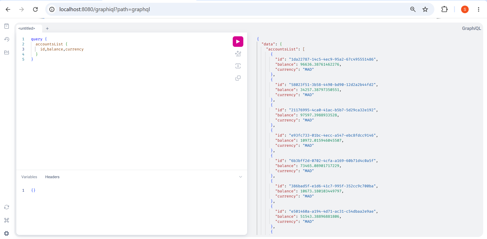

### 12.7 Requête accountById

On teste la requête pour récupérer un compte spécifique par son ID :

```graphql
query {
    accountById(id: "votre-uuid-ici") {
        id
        balance
        currency
        type
    }
}
```

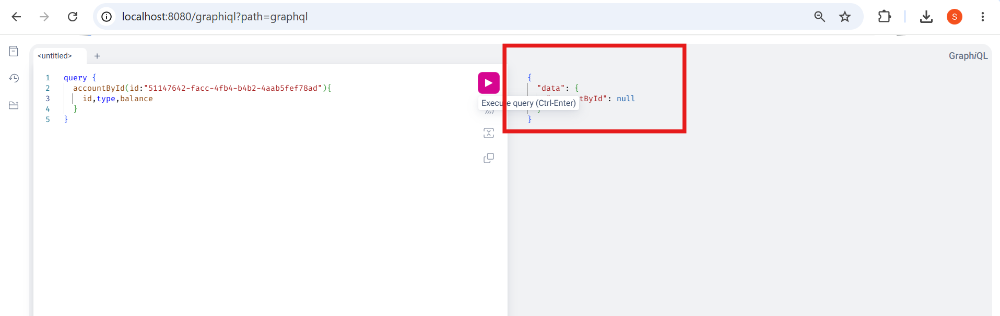

> **Remarque :** Le premier test retourne `null` car le nom de la méthode dans le contrôleur ne correspondait pas exactement au nom dans le schéma. Après correction (`accountById` → `accountById`), cela fonctionne.

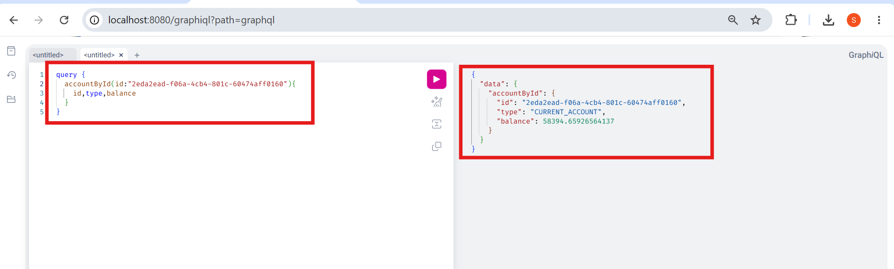

### 12.8 Gestion des erreurs — CustomDataFetcherExceptionResolver

Par défaut, quand une exception est levée dans GraphQL, le client reçoit une erreur générique `Internal Error`. Pour renvoyer un message d'erreur précis et utile, on crée un gestionnaire d'exceptions personnalisé :

```java
package net.tayebi.tp1_ssd_e_back_service.exceptions;

import graphql.ErrorClassification;
import graphql.GraphQLError;
import graphql.language.SourceLocation;
import graphql.schema.DataFetchingEnvironment;
import org.springframework.graphql.execution.DataFetcherExceptionResolverAdapter;
import org.springframework.stereotype.Component;
import java.util.List;

@Component  // Spring le détecte automatiquement
public class CustomDataFetcherExceptionResolver extends DataFetcherExceptionResolverAdapter {

    @Override
    protected GraphQLError resolveToSingleError(Throwable ex, DataFetchingEnvironment env) {
        return new GraphQLError() {
            @Override
            public String getMessage() {
                return ex.getMessage();  // Retourne le message de l'exception réelle
            }
            @Override
            public List<SourceLocation> getLocations() { return null; }
            @Override
            public ErrorClassification getErrorType() { return null; }
        };
    }
}
```

**Avant :** le client reçoit `Internal Server Error`

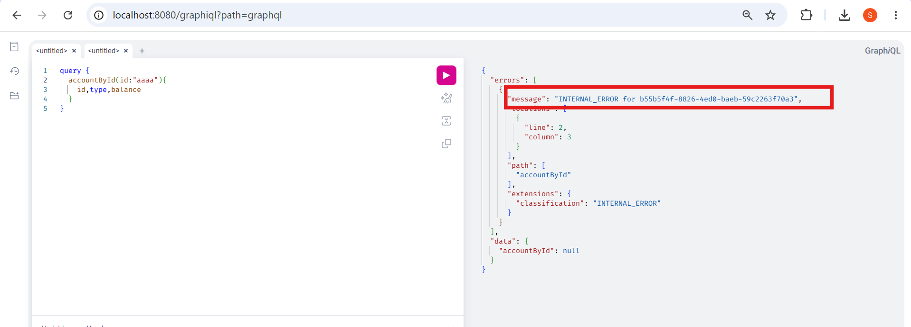

**Après :** le client reçoit le message précis de l'exception

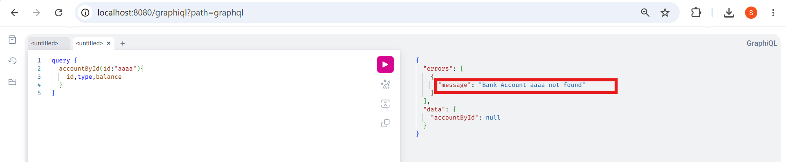

### 12.9 Mutation — Ajouter un compte

```graphql
mutation {
    addAccount(bankAccount: {
        balance: 75000
        currency: "MAD"
        type: "CURRENT_ACCOUNT"
    }) {
        id
        type
        balance
        currency
    }
}
```

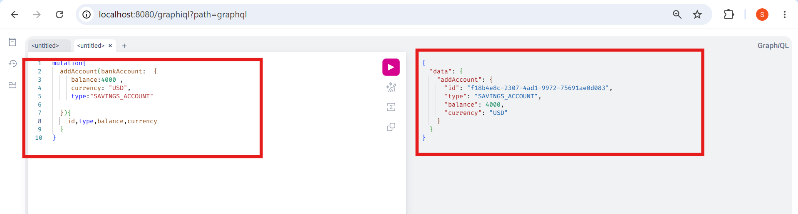

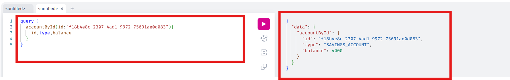

#### Utilisation de variables GraphQL

Pour rendre les mutations réutilisables (notamment depuis Angular), on utilise des **variables** :

```graphql
# Requête avec variables déclarées
mutation($t: String, $b: Float, $c: String) {
    addAccount(bankAccount: {
        balance: $b
        currency: $c
        type: $t
    }) {
        id
        type
        balance
        currency
    }
}
```

```json
// Variables (section Variables dans GraphiQL)
{ "b": 4000, "c": "USD", "t": "SAVINGS_ACCOUNT" }
```

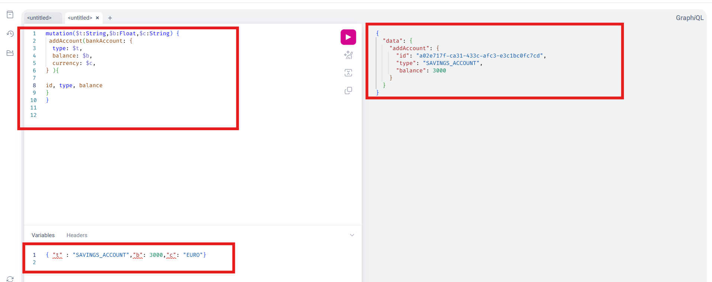

> **Avantage des variables :** La structure de la requête est fixe (on peut la stocker dans un fichier), seules les valeurs changent à chaque appel. C'est la façon recommandée d'utiliser GraphQL depuis un frontend Angular.

### 12.10 Mutation — Mise à jour d'un compte

On ajoute dans le schéma :
```graphql
type Mutation {
    addAccount(bankAccount: BankAccountDTO): BankAccount
    updateAccount(id: String, bankAccount: BankAccountDTO): BankAccount
    deleteAccount(id: String): Boolean
}
```

```graphql
mutation {
    updateAccount(id: "votre-uuid", bankAccount: {
        balance: 99000
        currency: "EUR"
        type: "SAVINGS_ACCOUNT"
    }) {
        id
        balance
        currency
        type
    }
}
```

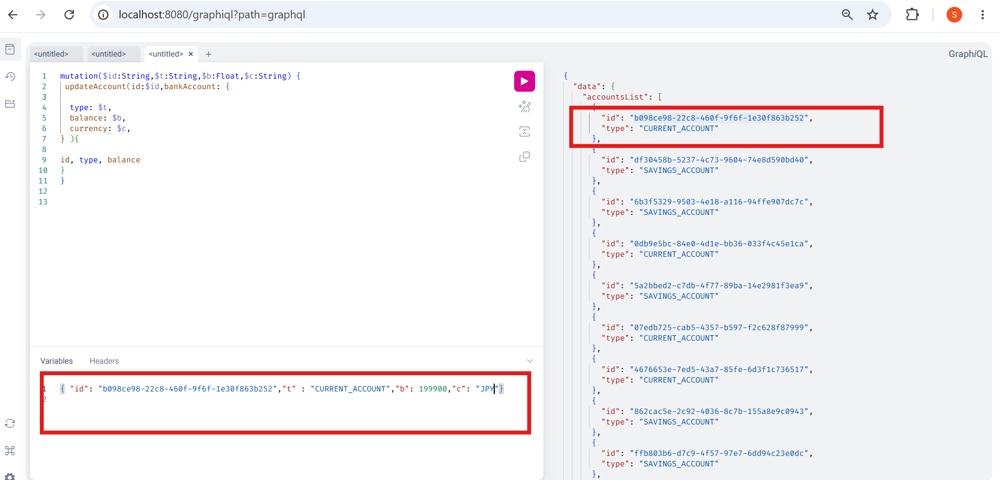

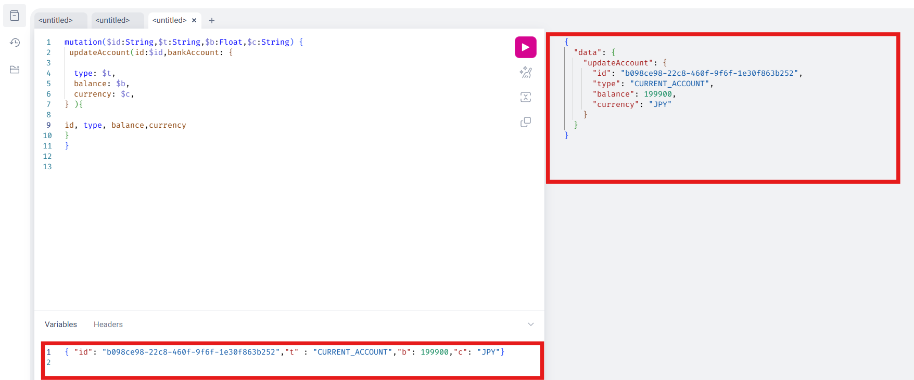

### 12.11 Mutation — Supprimer un compte

```graphql
mutation {
    deleteAccount(id: "votre-uuid")
}
```

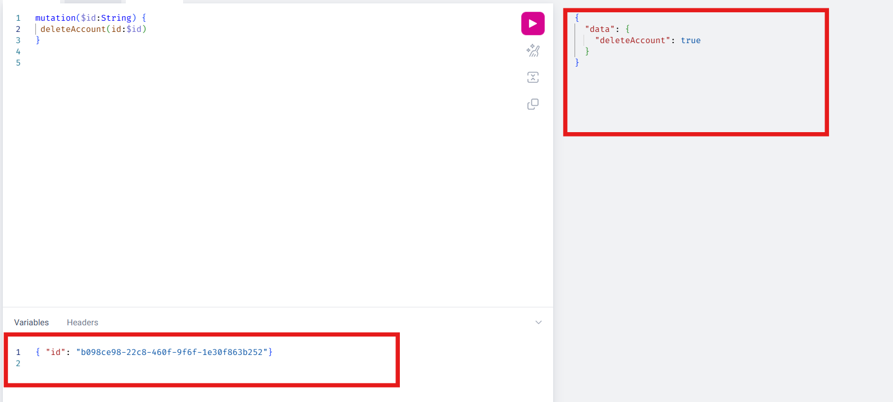

> **Note sur le type de retour :** Si on met `void` en Java et `String` dans le schéma, la valeur retournée sera `null`. On préfère retourner `Boolean` pour savoir si la suppression a réussi.

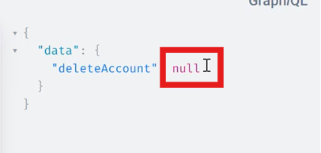

---

## 13. Entité Customer et relations

### 13.1 Entité Customer

On ajoute une entité `Customer` pour modéliser la relation entre un client et ses comptes bancaires.

```java
package net.tayebi.tp1_ssd_e_back_service.entities;

import jakarta.persistence.*;
import lombok.*;
import java.util.List;

@Entity
@NoArgsConstructor @AllArgsConstructor
@Data @Builder
public class Customer {

    @Id
    @GeneratedValue(strategy = GenerationType.IDENTITY) // ID auto-incrémenté (Long)
    private Long id;

    private String name;

    // Un client peut avoir plusieurs comptes (relation One-To-Many)
    @OneToMany(mappedBy = "customer")
    private List<BankAccount> bankAccounts;
}
```

> **Remarque :** `@GeneratedValue(strategy = GenerationType.IDENTITY)` : l'ID du `Customer` est un `Long` auto-incrémenté par la base, contrairement à `BankAccount` dont l'ID est un UUID `String` géré manuellement.

### 13.2 CustomerRepository

```java
package net.tayebi.tp1_ssd_e_back_service.repositories;

import net.tayebi.tp1_ssd_e_back_service.entities.Customer;
import org.springframework.data.jpa.repository.JpaRepository;

// @RepositoryRestResource non mis : on ne veut pas exposer Customer via Spring Data REST
public interface CustomerRepository extends JpaRepository<Customer, Long> {
}
```

### 13.3 Ajout des clients et comptes dans le CommandLineRunner

On enrichit le `CommandLineRunner` pour insérer des clients avec leurs comptes :

```java
@Bean
CommandLineRunner start(BankAccountRepository bankAccountRepository,
                        CustomerRepository customerRepository) {
    return args -> {
        // Créer des clients
        List<String> names = List.of("Ahmed", "Fatima", "Karim", "Sara", "Mohamed");
        names.forEach(name -> {
            Customer customer = Customer.builder().name(name).build();
            customerRepository.save(customer);
        });

        // Créer des comptes pour chaque client
        customerRepository.findAll().forEach(customer -> {
            for (int i = 0; i < 3; i++) {
                BankAccount bankAccount = BankAccount.builder()
                        .id(UUID.randomUUID().toString())
                        .type(Math.random() > 0.5
                                ? AccountType.CURRENT_ACCOUNT
                                : AccountType.SAVINGS_ACCOUNT)
                        .balance(10000 + Math.random() * 90000)
                        .createdAt(new Date())
                        .currency("MAD")
                        .customer(customer)
                        .build();
                bankAccountRepository.save(bankAccount);
            }
        });
    };
}
```

### 13.4 Visualisation en base de données

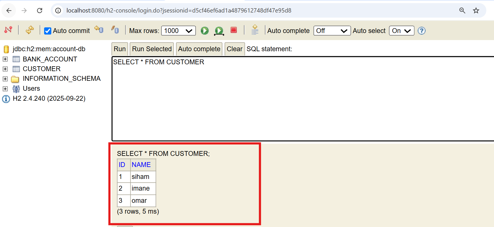

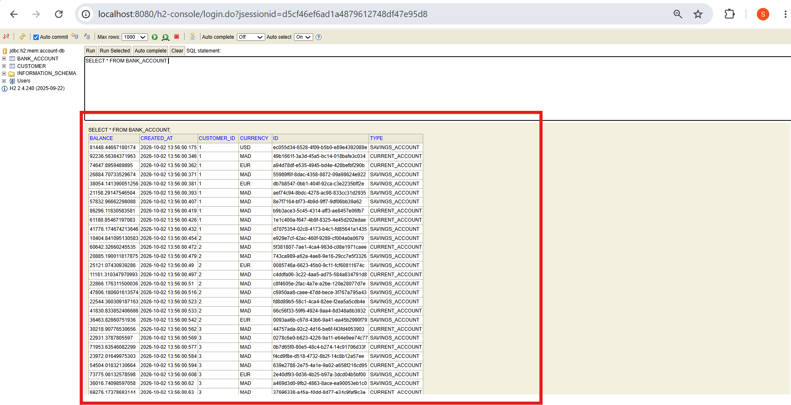

### 13.5 Requête GraphQL avec les clients

On peut désormais interroger les clients avec leurs comptes :

```graphql
query {
    customers {
        id
        name
    }
}
```

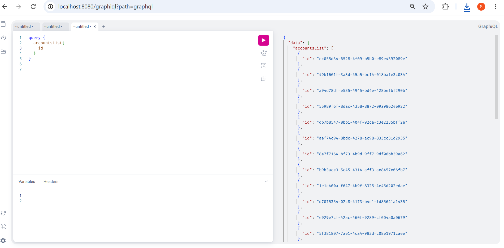

```graphql
query {
    accountsList {
        id
        balance
        type
        customer {
            id
            name
        }
    }
}
```

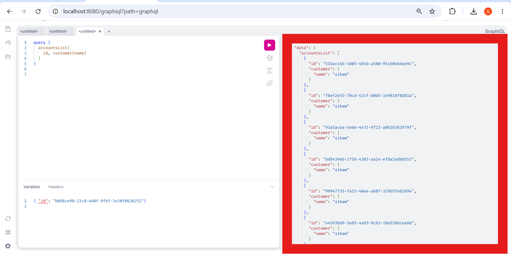

```graphql
query {
    customers {
        id
        name
        bankAccounts {
            id
            balance
            type
        }
    }
}
```

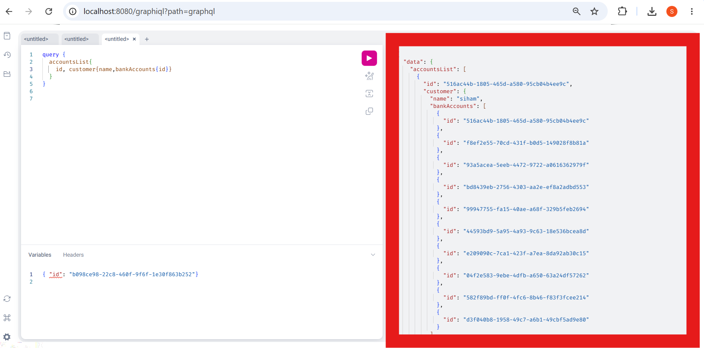

> **Puissance de GraphQL :** On peut naviguer dans le graphe d'objets dans n'importe quelle direction, et choisir exactement les champs désirés à chaque niveau. C'est impossible avec REST sans créer des endpoints dédiés pour chaque combinaison.

### 13.6 Problème de boucle infinie avec REST

Lorsqu'on accède à `/api/bankAccounts` en REST après avoir ajouté la relation bidirectionnelle (`BankAccount` → `Customer` → `BankAccount` → ...), on obtient une **boucle infinie** de sérialisation JSON :

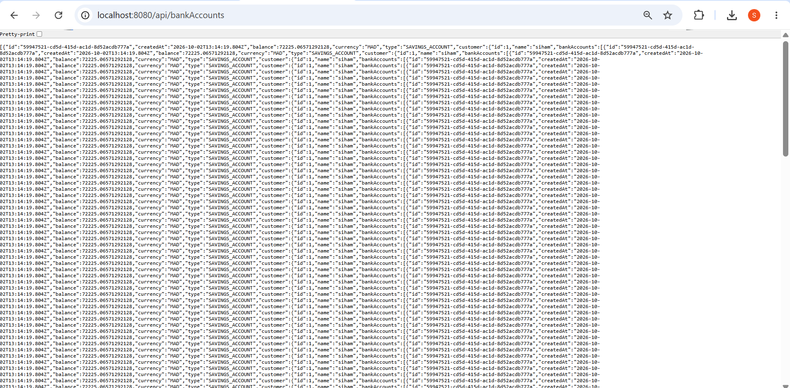

**Solution côté REST :** On utilise `@JsonProperty(access = JsonProperty.Access.WRITE_ONLY)` sur la liste de comptes dans `Customer` :

```java
import com.fasterxml.jackson.annotation.JsonProperty;

@OneToMany(mappedBy = "customer")
@JsonProperty(access = JsonProperty.Access.WRITE_ONLY) // Exclut du JSON de sortie
private List<BankAccount> bankAccounts;
```

> **Important :** `@JsonProperty(access = WRITE_ONLY)` résout le problème pour **REST** uniquement. **GraphQL n'est pas affecté** par cette annotation : il gère lui-même les champs à retourner grâce au schéma et à la requête du client.

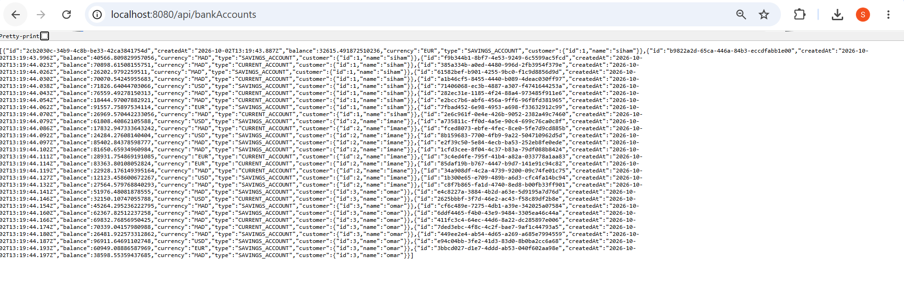

---

## 14. Comparaison des approches

### 14.1 Tableau récapitulatif

| Critère | REST (`/api`) | Spring Data REST | GraphQL |
|---|---|---|---|
| **Code contrôleur** | Manuel complet | Aucun | Méthodes annotées |
| **Format réponse** | JSON libre | JSON + HATEOAS | JSON, champs choisis |
| **Sélection des champs** | Non (tout retourné) | Via Projection (serveur) | Via requête (client) |
| **Pagination** | Manuelle | Automatique | Manuelle |
| **Documentation** | Swagger/OpenAPI | Automatique | Schéma `.graphqls` |
| **Gestion des relations** | Risque boucle infinie | HATEOAS (liens) | Navigation dans le graphe |
| **Mutations** | POST/PUT/DELETE | Automatique | `type Mutation` |
| **Gestion des erreurs** | Exception REST | Exception REST | Handler personnalisé |

### 14.2 Quand utiliser quelle technologie ?

```
REST      → API publique universelle, documentation simple
GraphQL   → Interface utilisateur (UI) : le client choisit ses données
SOAP      → Clients legacy, contrats stricts
gRPC      → Communication backend-backend rapide et performante
```

> Pour la suite du développement, on pourrait connecter ces deux microservices (REST et GraphQL) et y ajouter SOAP et gRPC selon les besoins du projet. **Spring Data REST** se rapproche un peu de GraphQL dans l'idée : il expose les entités automatiquement, mais côté serveur — pas côté client.

---

## 15. Conclusion

### 15.1 Bilan des tâches réalisées

| # | Tâche | Statut |
|---|---|---|
| 1 | Projet Spring Boot (Web, JPA, H2, Lombok) | ✅ |
| 2 | Entité JPA `BankAccount` avec `@Enumerated(EnumType.STRING)` | ✅ |
| 3 | `BankAccountRepository` Spring Data | ✅ |
| 4 | Test couche DAO via CommandLineRunner + console H2 | ✅ |
| 5 | Web Service RESTful complet (GET, POST, PUT, DELETE) | ✅ |
| 6 | Tests avec Postman | ✅ |
| 7 | Documentation Swagger / OpenAPI (SpringDoc) | ✅ |
| 8 | Spring Data REST + Projections + alias @RestResource | ✅ |
| 9 | DTOs (`RequestDTO`, `ResponseDTO`) | ✅ |
| 10 | Couche Service (`AccountService`, `AccountServiceImpl`, `AccountMapper`) | ✅ |
| 11 | Web Service GraphQL (Query + Mutation + Variables + Handler d'erreurs) | ✅ |
| 12 | Entité `Customer` + relations OneToMany + intégration GraphQL | ✅ |

### 15.2 Compétences acquises

| Compétence | Technologies |
|---|---|
| Entités JPA et gestion des enums | `@Entity`, `@Id`, `@Enumerated`, `@OneToMany` |
| Repository Spring Data | `JpaRepository`, méthodes dérivées (`findByType`) |
| API REST manuelle | `@RestController`, `@GetMapping`, `@PostMapping`, `@PutMapping`, `@DeleteMapping` |
| API REST automatique | Spring Data REST, `@RepositoryRestResource`, `@RestResource`, `@Param` |
| Pagination et HATEOAS | Spring Data REST natif |
| Projections Spring Data REST | `@Projection` |
| Documentation API | SpringDoc OpenAPI, Swagger UI |
| DTOs et Mappers | `BankAccountRequestDTO`, `BankAccountDTOResponse`, `BeanUtils.copyProperties` |
| Couche Service transactionnelle | `@Service`, `@Transactional` |
| API GraphQL | Schéma `.graphqls`, `@QueryMapping`, `@MutationMapping`, `@Argument` |
| Variables GraphQL | Requêtes paramétrées réutilisables depuis Angular |
| Gestion des erreurs GraphQL | `DataFetcherExceptionResolverAdapter` |
| Relations bidirectionnelles | `@OneToMany`, `@JsonProperty(WRITE_ONLY)` |

### 15.3 Points clés à retenir

1. **`@Enumerated(EnumType.STRING)`** : indispensable pour stocker les enums de façon lisible en base
2. **Spring Data REST** génère un CRUD complet avec pagination et HATEOAS sans écrire de contrôleur
3. **Les DTOs** séparent les données entrantes des données sortantes et évitent d'exposer l'entité JPA
4. **`@Transactional`** garantit la cohérence des opérations en base de données
5. **GraphQL** est plus puissant que REST pour les interfaces : le client choisit exactement les champs retournés
6. **Les variables GraphQL** permettent de paramétrer les requêtes, idéal pour l'intégration frontend (Angular)
7. **`@JsonProperty(WRITE_ONLY)`** évite les boucles infinies en REST avec les relations bidirectionnelles, mais n'affecte pas GraphQL

---

*Compte rendu rédigé dans le cadre du module Architecture des Systèmes Distribués — ENSET Mohammedia, Université Hassan II, Filière BDCC II — Octobre 2026*