# Activité Pratique N°1 - Implémentation d'un micro service avec spring boot
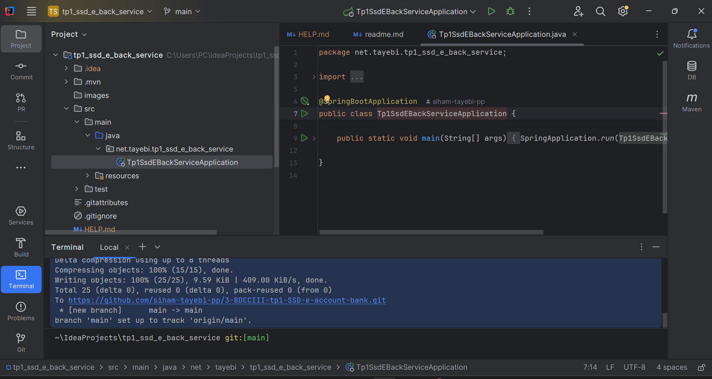

pis on a cree entities et rpositories pacjages
 et apres bank account clase et accoutn type

```java
package net.tayebi.tp1_ssd_e_back_service.entities;

import jakarta.persistence.Entity;
import jakarta.persistence.Id;
import lombok.AllArgsConstructor;
import lombok.Builder;
import lombok.Data;
import lombok.NoArgsConstructor;
import net.tayebi.tp1_ssd_e_back_service.enums.AccountType;

import java.util.Date;

@Entity
@Data
@AllArgsConstructor
@NoArgsConstructor
@Builder
public class BankAccount {
 @Id
 private String id;
 private Date createdAt;
 private double balance;
 private String currency;
 private AccountType type;

}


```


```java
package net.tayebi.tp1_ssd_e_back_service.entities;

public enum AccountType {
    CURRENT_ACCOUNT, SAVINGS_ACCOUNT
}

```
 puis repositories 

package net.tayebi.tp1_ssd_e_back_service.repositories;

import net.tayebi.tp1_ssd_e_back_service.entities.BankAccount;
import org.springframework.data.jpa.repository.JpaRepository;

public interface BankAccountRepository extends JpaRepository<BankAccount, String> {

}


puis notr ebean dans le programme main pour quil sexecute un fois lapp demare
auto 


package net.tayebi.tp1_ssd_e_back_service;

import net.tayebi.tp1_ssd_e_back_service.enums.AccountType;
import net.tayebi.tp1_ssd_e_back_service.entities.BankAccount;
import net.tayebi.tp1_ssd_e_back_service.repositories.BankAccountRepository;
import org.springframework.boot.CommandLineRunner;
import org.springframework.boot.SpringApplication;
import org.springframework.boot.autoconfigure.SpringBootApplication;
import org.springframework.context.annotation.Bean;

import java.util.Date;
import java.util.UUID;

@SpringBootApplication
public class Tp1SsdEBackServiceApplication {

    public static void main(String[] args) {
        SpringApplication.run(Tp1SsdEBackServiceApplication.class, args);
    }
    @Bean
    CommandLineRunner start( BankAccountRepository bankAccountRepository) {
        return args -> {
          for(int i=1; i<=10; i++) {
             BankAccount bankAccount =  BankAccount.builder()
                     .id(UUID.randomUUID().toString())
                     .type(Math.random()>0.5? AccountType.CURRENT_ACCOUNT:AccountType.SAVINGS_ACCOUNT)
                     .balance(10000+Math.random()*90000)
                     .createdAt(new Date())
                     .currency("MAD")
                     .build();
             bankAccountRepository.save(bankAccount);
          }
        };
    }

}


et dna sfich config en pase a fair
la on va speciifer url port active h2
spring.application.name=tp1_ssd_e_back_service
spring.datasource.url=jdbc:h2:mem:account-db
spring.h2.console.enabled=true
server.port=8080


puis on execute 


pour graalvm 
une fois jar genrer on le copie il devient excutable native pour que demarage soit tres rapide

 pusi on entre au url http://localhost:8080/h2-console
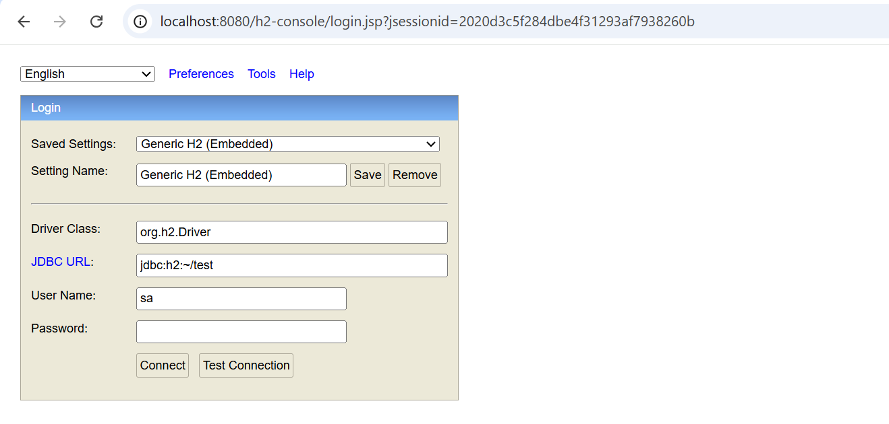


et voila on est netre a notre bd 
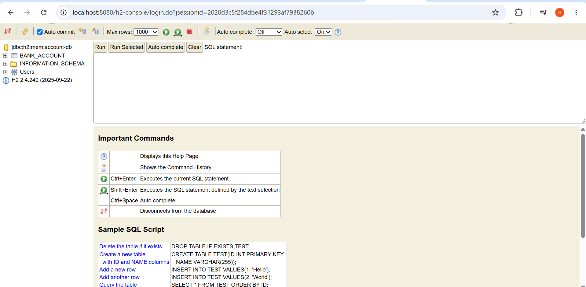
la on voi le type en o et 1 cad on doit le cnhager @enumerated pur que ca se sotjce en dt 
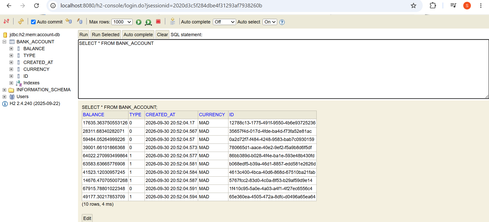


package net.tayebi.tp1_ssd_e_back_service.entities;

import jakarta.persistence.Entity;
import jakarta.persistence.EnumType;
import jakarta.persistence.Enumerated;
import jakarta.persistence.Id;
import lombok.AllArgsConstructor;
import lombok.Builder;
import lombok.Data;
import lombok.NoArgsConstructor;

import java.util.Date;

@Entity
@Data
@AllArgsConstructor
@NoArgsConstructor
@Builder
public class BankAccount {
@Id
private  String id;
private Date createdAt;
private double balance;
private String currency;
@Enumerated(EnumType.STRING)
private  AccountType type;

}

et voila type est en sr 
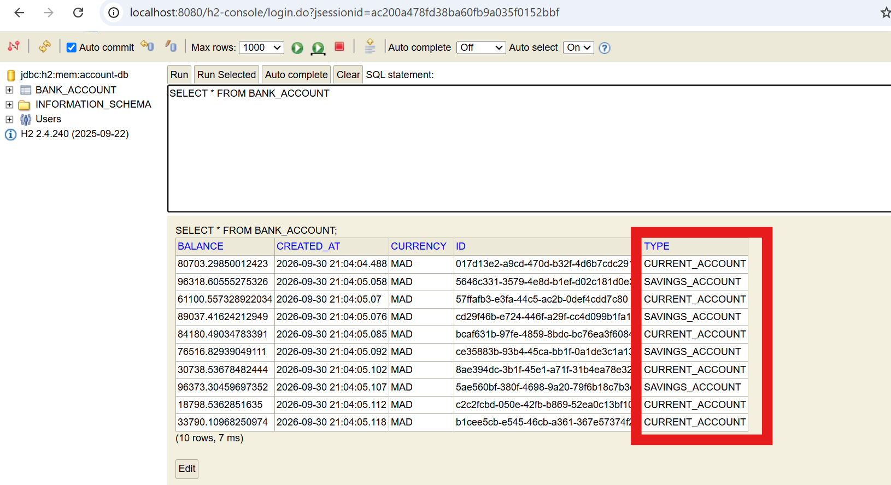

on cree pakcage ou directory web avec   account rest conroller


package net.tayebi.tp1_ssd_e_back_service.web;


import lombok.AllArgsConstructor;
import net.tayebi.tp1_ssd_e_back_service.entities.BankAccount;
import net.tayebi.tp1_ssd_e_back_service.repositories.BankAccountRepository;
import org.springframework.beans.factory.annotation.Autowired;
import org.springframework.web.bind.annotation.GetMapping;
import org.springframework.web.bind.annotation.PathVariable;
import org.springframework.web.bind.annotation.RestController;

import java.util.List;

@RestController
@AllArgsConstructor
public class AccountRestController {
//    @Autowired
private BankAccountRepository bankAccountRepository;
@GetMapping("/bankAccounts")
public List<BankAccount> bankAccounts() {
return bankAccountRepository.findAll();
}

    @GetMapping("/bankAccounts/{id}")
    public BankAccount bankAccount(@PathVariable String id) {
        return  bankAccountRepository.findById(id).orElseThrow(
                ()->new RuntimeException(String.format("Bank account with id %s not found", id))
        );
    }


}


on teste dans le site
http://localhost:8080/bankAccounts
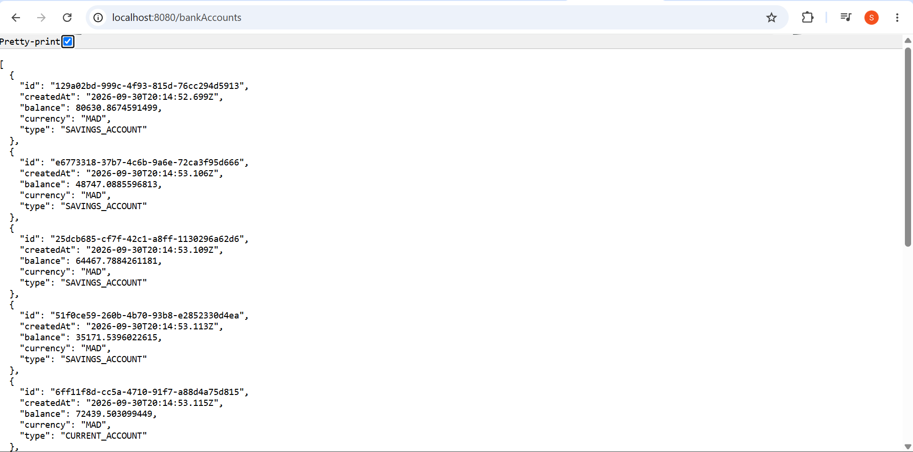

on tes avec id 
 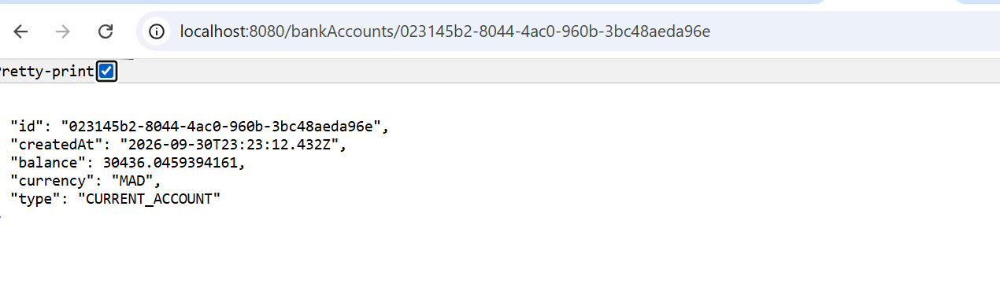
put modifier tt attribue
path modifier qu attribut nvoye dans requette

@DeleteMapping("/bankAccounts/{id}")
public void deleteAccount(@PathVariable String id) {
bankAccountRepository.deleteById(id);
}

    @PostMapping("/bankAccounts")
    public BankAccount save(@RequestBody  BankAccount bankAccount) {
        return bankAccountRepository.save(bankAccount);
    }
    @PutMapping("/bankAccounts/{id}")
    public BankAccount update(@RequestBody  BankAccount bankAccount, @PathVariable String id) {
        BankAccount account = bankAccountRepository.findById(bankAccount.getId()).orElseThrow(null);
        if (account.getBalance()!=null) account.setBalance(bankAccount.getBalance());
        if(account.getCurrency() !=null) account.setCurrency(bankAccount.getCurrency());
        if(account.getType() !=null) account.setType(bankAccount.getType());
        if(account.getCreatedAt() !=null) account.setCreatedAt(new Date());
        return bankAccountRepository.save(account);
    } on a joute ces mth on apsse au test avec postman

on test la route post et   pour save ccomem pos donc headers tq conttnent type  et value quil est app json e dna sbody on met le sodnnes a envoyer
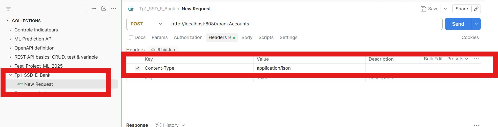
on ajoute c apour que lid se genrre auto
if(bankAccount.getId()==null) bankAccount.setId(UUID.randomUUID().toString());

comme ca voial c bank account bein ajout
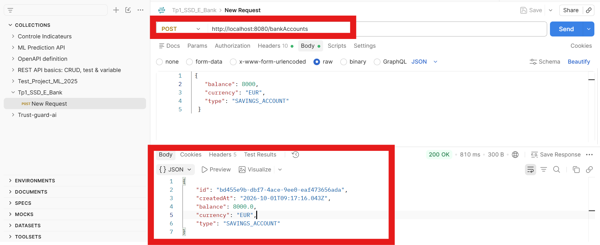

on essaye de update ce bank acocunt via par exple eid de lelt crer 

e route put http://localhost:8080/bankAccounts/bd455e9b-dbf7-4ace-9ee0-eaf473656ada
test with patch 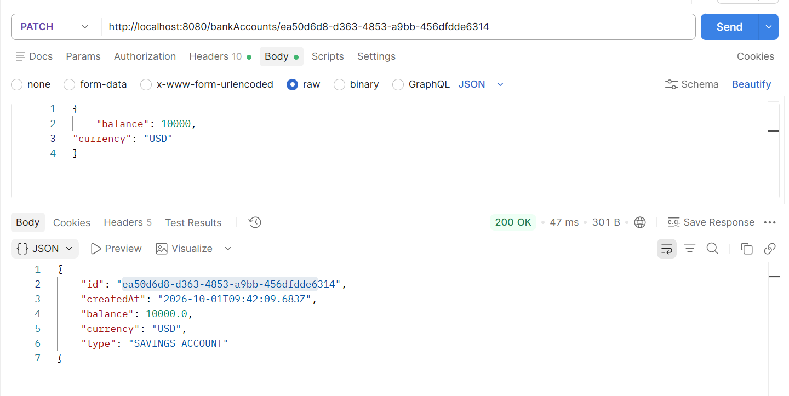
test with put
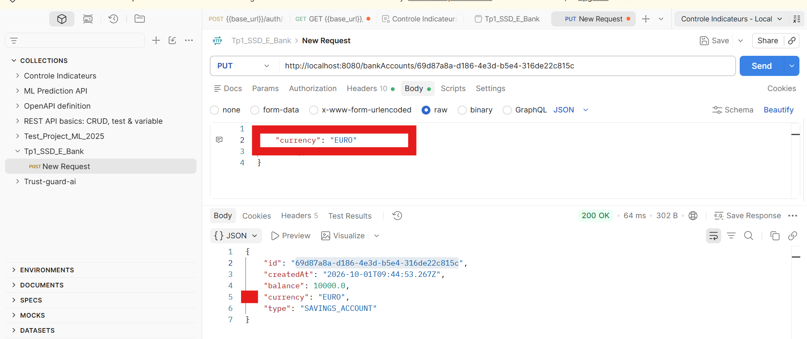


     